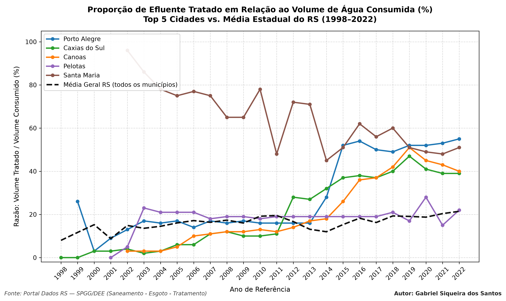

Compara o índice de esgoto tratado dos 5 municípios mais populosos do RS (Porto Alegre, Caxias do Sul, Canoas, Pelotas e Santa Maria) com a média geral do estado.

• Visualização: 

• Metodologia e Definição do Indicador

O índice analisado **não reflete o volume físico absoluto de água consumida** (em $m^3$ ou litros), mas sim uma **razão percentual de eficiência do serviço**, equivalente ao indicador **IN046** do Sistema Nacional de Informações sobre Saneamento (SNIS):

$$\text{Índice (\%)} = \left( \frac{\text{Volume de Esgoto Tratado}}{\text{Volume de Água Consumida}} \right) \times 100$$

 **Valores próximos de 100%:** indicam que a cidade trata um volume de efluente quase equivalente ao total de água potável consumida.
 **Linha tracejada preta (Média RS):** representa a média aritmética simples dessa proporção entre todos os municípios gaúchos com dados reportados em cada ano.

• Tecnologias: Python 3.13 (Pandas, NumPy, Matplotlib).

• Como Reproduzir: Instale as dependências (pip install pandas numpy matplotlib) e execute python codigo.py.

• Créditos: Autor: Gabriel Siqueira dos Santos | Fonte: Portal de Dados Abertos do RS (Dados RS) (SPGG/DEE).